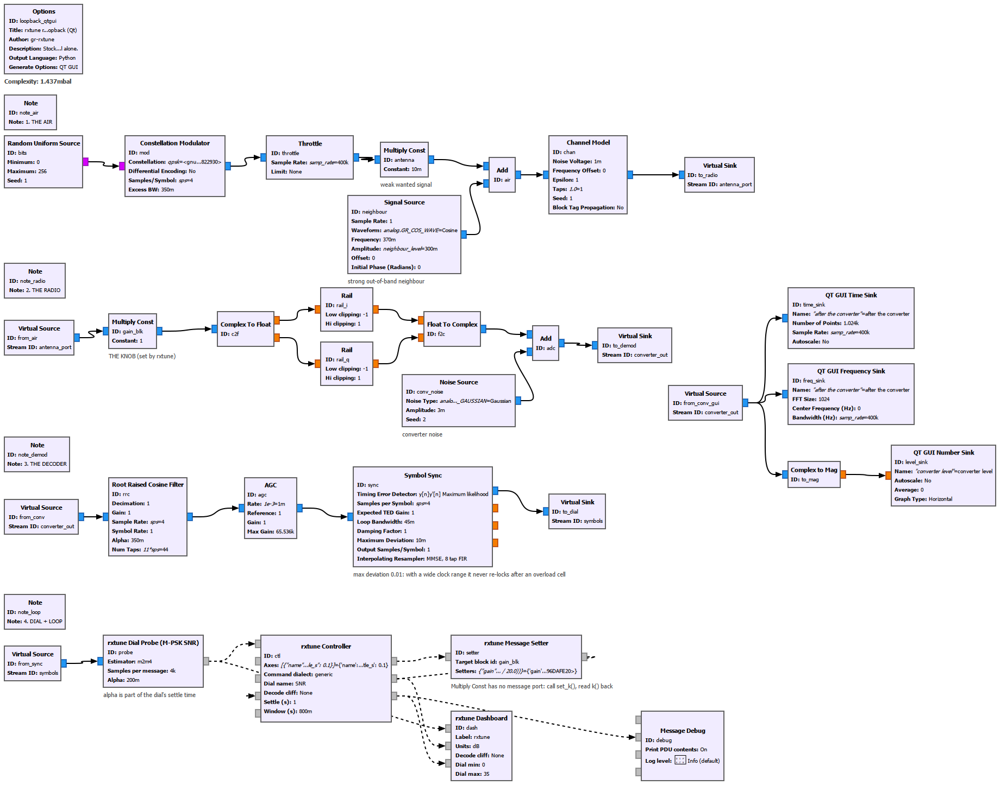
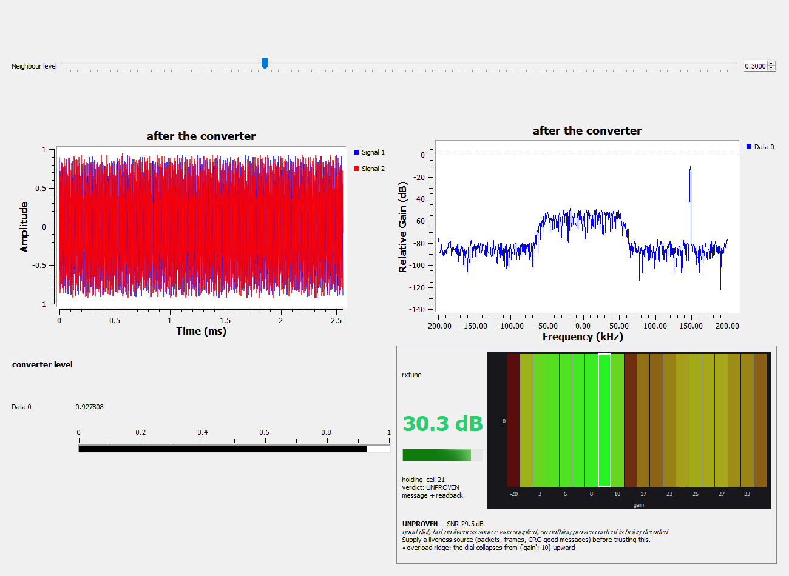
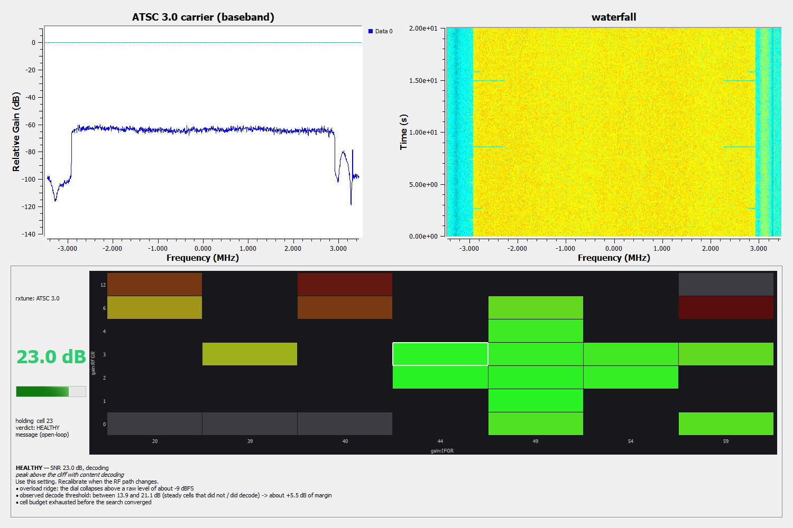
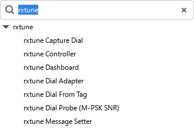
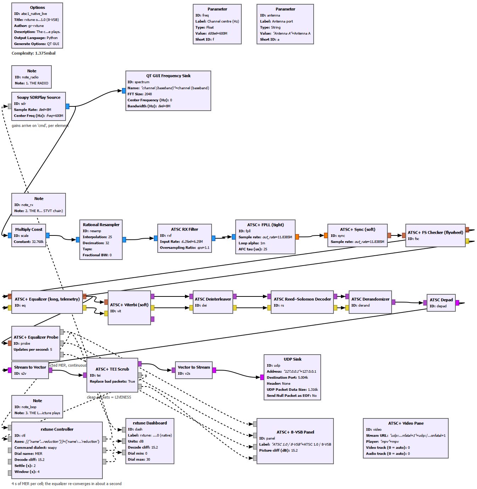

# gr-rxtune

**Tune a receiver by what the decoder says, not by what the power meter says —
and get an honest answer when software cannot help.**

Most "automatic gain" code servos on signal power or on a raw-sample proxy.
Power is not decodability: the strongest setting is often overloaded, and an
antenna that reads beautifully on a waterfall may never decode. `rxtune` closes
the loop on the *decoder's own quality number* — MER, CNR, SNR, Viterbi BER —
and searches every knob the radio has against it.

```
$ rxtune sim island
VERDICT  ISLAND  -  MER 16.9 dB, +1.7 dB over the cliff, decoding
  why    : a narrow optimum (6 dB wide in gain) with failure on both sides
  use    : {'gain:RF': 8, 'gain:IF': 30}
  note   : overload ridge: the dial collapses above a raw level of about -6 dBFS
  advice : Usable, but narrow: small drifts will fall off it. Something ahead of the radio
           is too hot (an LNA or a strong neighbour); less gain ahead of the radio would widen it.

$ rxtune sim aperture
VERDICT  APERTURE_LIMITED  -  MER 6.2 dB, 9.0 dB short of the cliff - this is physical
  why    : the dial is flat (1 dB) across 29 dB of gain with no clipping: more gain adds
           signal and noise alike
  NOT recommended (best cell was {'gain:RF': 0, 'gain:IF': 45})
  advice : Software cannot fix this. The limit is set before the radio's gain stages ...
```

## The method

1. **Find the decoder's continuous truth-dial** and surface it live.
2. **Search everything against it** — gain elements, antenna port, channel,
   recovery config, and the hour of day — coarse grid, then fine, then hill-climb.
3. **Read the SHAPE of the curve.** Flat versus gain is aperture-limited. Falling
   at high gain is overload. A healthy dial with nothing decoded is plumbing. A
   dial that swings at one fixed setting is multipath. Rail transients at every
   gain, with a high dial, are impulse noise. Each becomes a verdict with a number
   in dB, including *"this is physical; software can't fix it."*
4. **Demand liveness proof.** A dial without decoded content is a mirage. No
   setting is ever recommended unless packets, frames or audio actually came out.
5. **Recalibrate forever.** Every result is stored against a fingerprint of the
   RF path and never reused across a change; the product is the loop, not the
   settings.

## Two layers

**`rxtune` — pure Python, no GNU Radio.** `pip install .` The Dial / Knob /
Verdict interfaces, the optimizer, the shape classifier, runtime knob discovery
through SoapySDR (no per-device code; optional YAML *profiles* are data), decoder
attachment, a store with staleness, a simulated receiver, and a CLI.

**`gnuradio.rxtune` — GNU Radio 3.10 blocks on top of it**, Python only (nothing
to compile):

| Block | What it does |
|---|---|
| **rxtune Controller** | Headless. Dial messages in; one command dict per knob write out, in the dialect the target block really accepts. |
| **rxtune Dial Probe (M-PSK SNR)** | Stream in, dial out, stock `probe_mpsk_snr_est_c` inside — examples run with no custom decoder. |
| **rxtune Dial From Tag** | Turns a quality *tag* (e.g. `mpsk_snr_est_cc`'s `snr`) into a dial. |
| **rxtune Dial Adapter** | A decoder's own telemetry in, a dial out. Ships ATSC (equaliser training error → MER) and NRSC-5 / HD Radio (nrsc5 MER, BER). |
| **rxtune Capture Dial** | For decoders whose honest quality number only exists offline: records a few seconds per cell and lets the decoder's own tools judge the file (dial + proof of decode). |
| **rxtune Message Setter** | Command in, setter *method call* on another block, with readback. For everything that has no message port. |
| **rxtune Dashboard** | Optional Qt widget: live dial, gain-grid heatmap, verdict text. Docks like any QT GUI widget. |

**Follow along in GNU Radio Companion, no radio needed: [docs/WALKTHROUGH.md](docs/WALKTHROUGH.md).**

The example flowgraph - the air, a radio with one gain knob and a converter that
clips, a stock demodulator, and the loop (dashed wires are messages):



Running, docked beside stock QT GUI widgets. The heatmap is the search: a slope,
a peak, and the collapse where the neighbour hits the converter's rails:



On a **real radio**: `examples/atsc3_live.grc` tunes an SDRplay on a live ATSC 3.0
(NextGen TV) carrier. The controller sets both gain elements **by message** on the stock
Soapy source; an external receiver judges a short capture at every cell (SNR off the
frame's known cells, plus an actual decode as proof); grey = clipped or no decode, green =
decodes. The white box is the pick, confirmed by a second, longer look:



The blocks in GRC's tree:



## The loop owns the radio

Most decoders grab the SDR themselves, and then nothing else can touch the gain.
So decoders attach in one of three ways, in this order of preference:

- **(a) rxtune owns the SDR and pipes IQ to the decoder** — stdin, a file, ZMQ,
  or a flowgraph. `examples/hw_nrsc5.py` drives an *unmodified* `nrsc5` this way;
  `examples/hw_atsc3_capture.py` records a few seconds per cell and lets an ATSC 3.0
  receiver's own offline tools judge the file.
- **(b) the decoder exposes a runtime control** — wrap it in a ten-line adapter.
- **(c) restart the decoder for every grid cell** — slow calibration only.
  `examples/hw_atsc_stvt.py`.

## Dials are not all equal, and the library knows it

A `DialSpec` carries the metric's name, units, direction, decode cliff, settle
time, averaging window, and **whether it is continuous below the cliff**. MER,
CNR, Es/N0 and Viterbi BER have a gradient below the cliff, so they can *rescue*
a signal that does not decode yet. CRC- or message-rate dials (AIS, ADS-B) are
zero until decoding starts, so they can only optimise range — `rxtune` refuses a
rescue search with one and says why (`BLIND_DIAL`).

## Quick start

```
pip install .                 # or: pip install -e .[test]
rxtune selftest               # 13 numeric gates on a simulated receiver, no radio
rxtune sim fading -v          # watch a search and its reasoning
rxtune discover               # every knob your SoapySDR device reports
python examples/headless_loopback.py      # GNU Radio, stock DSP, no radio, no Qt
```

In your own code:

```python
from rxtune.loop import tune
from rxtune.soapy import SoapyFrontend
from rxtune.attach import LineScraper, PipeDecoder, FileGrowth
from rxtune.dial import DialSpec

dial = LineScraper(DialSpec("SNR", "dB", cliff=9.0, settle_s=2, window_s=4), r"snr=([\d.]+)")
dec  = PipeDecoder(["my_decoder", "--iq", "-"], dial)
fe   = SoapyFrontend("driver=rtlsdr", rate=2.4e6, freq=162.4e6)
fe.start(sink=dec.start())
print(tune(fe, dial, FileGrowth("decoded.out")))
```

GNU Radio, from the source tree (nothing installed): see `examples/_devpath.py`;
for GRC set `GRC_BLOCKS_PATH` to this repo's `grc/` directory. A CMake install
(`cmake .. && make install`) puts the blocks and the core package in the usual
places. See `docs/USAGE.md`.

## What the stock source blocks really accept

Read from the GNU Radio 3.10 source and then **measured on hardware**
(details: `docs/DESIGN.md` §5, `docs/TEST_REPORT.md`):

| | gr-soapy | gr-uhd | gr-osmosdr |
|---|---|---|---|
| Command port | `cmd`, dict only | `command` | **none** (GRC draws one; the block has no port) |
| Per-element gain by message | **yes** — `{"gain": {"name": "IFGR", "gain": 40.0}}` | no, overall only | — |
| Device settings by message | **no** in practice: stops the source block on SoapySDRPlay | — | — |
| Readback | none over messages | none | none |

Hence the Message Setter block, and the controller's *device-handle mode* in
which it holds the SoapySDR device itself and reads every write back.

## Status

0.1.0 — first extraction. `docs/TEST_REPORT.md` says exactly what was tested,
what failed, and what could not be tested and why. Not yet on CGRAN or conda.

## A native receiver in the loop

`examples/atsc1_native_live.grc` puts the controller in the loop on an ATSC 1.0 (8-VSB) receiver made
of GNU Radio blocks ([gr-atscplus](https://github.com/Felbs/Software-TV-Tuner/tree/grc-atsc1/gr-atscplus), branch `grc-atsc1`), tuned live from the
equalizer's MER while the television picture plays in the window. HEALTHY verdict in 142 s over 21
gain cells; 240 of 240 video frames decoded in every window sampled during the search.



## License

GPL-3.0-or-later, to match the GNU Radio ecosystem. See `COPYING`.

## Acknowledgments & prior art

gr-rxtune extracts a method that grew up inside two receiver projects, and it
stands on ideas the wider SDR community worked out first. Nobody we found
ships this whole loop, but nearly every piece of control-loop hygiene in it
was somebody else's idea before it was ours — credit where it's due (the long
version is `docs/PRIOR_ART.md`):

- **[dump1090-fa adaptive gain](https://github.com/flightaware/dump1090)**
  (FlightAware, Oliver Jowett) — our separate settle timers, the half-step
  hysteresis measured in *real* dB, duty-cycled measurement for small CPUs,
  and a reason string on every change all follow `adaptive.c`. Its burst mode
  taught us the rule we now treat as law: a decoder dial cannot tell "no
  signal" from "clipped", so a cheap raw-sample overload check sits beside it
  as a veto. Theirs servos one RTL-SDR gain on sample statistics; ours
  searches many knobs on decoder truth.
- **[readsb `--gain=auto`](https://github.com/wiedehopf/readsb)** and
  **[autogain1090](https://github.com/wiedehopf/adsb-scripts)** (wiedehopf) —
  fast-attack / slow-release, a start-up sweep whose step halves (our coarse →
  fine → hill-climb is the same idea generalised), rate-limiting any large
  step, and the minimum-evidence guard ("fewer than 1000 messages: do
  nothing").
- **[radiosonde_auto_rx](https://github.com/projecthorus/radiosonde_auto_rx)**
  (Project Horus, Mark Jessop) — the wiki's *Gain Optimization Notes* describe,
  by hand and by eye, exactly the curve shapes our classifier names: SNR that
  stops rising with gain, a noise floor that is flat and then has a knee. That
  page is the clearest statement of the need we found.
- **[AutomaticGainControl](https://github.com/wizardyesterday/AutomaticGainControl)**
  (wizardyesterday) — a power AGC, which is the approach we deliberately do
  *not* take, but its hardware seam is the right one: the library is handed a
  get-gain and a set-gain callback and never touches a device. Our `Knob` is
  that seam; its blanking counter is our settle time.
- **[substation](https://github.com/simonholliday/substation)** (Simon
  Holliday) — its documentation of how differently devices expose gain (a
  HackRF with no AGC and 8 dB LNA steps, an Airspy HF+ whose "gain" is an
  attenuator running −48…0 dB, a driver that reports an AGC it does not have)
  became the test matrix for our runtime knob discovery. Facts cited; no text
  or code used (it is AGPL).
- **[SoapySDR](https://github.com/pothosware/SoapySDR)** and
  **[SoapySDRPlay3](https://github.com/pothosware/SoapySDRPlay3)** (Josh Blum
  and contributors) — the per-element gain API is what makes "any SDR, no
  per-device code" possible at all.
- **Cognitive-radio decision engines** — Rondeau, Le, Rieser and Bostian,
  *Cognitive Radios with Genetic Algorithms* (SDR Forum 2004), for treating
  radio parameters as a search space with constraint masking; and Melissa
  Elkadi's thesis *Cognitive and Adaptive Equalizer Implementation in GNU
  Radio* (University of Arizona, 2020), the closest thing in spirit to our
  config shootout — it is where we took per-arm running statistics from, and
  it reached the same conclusion we did about GNU Radio: feedback belongs on
  message ports.
- **[gr-dvbs2rx](https://github.com/igorauad/gr-dvbs2rx)** (Igor Freire) — the
  model for how a modern out-of-tree module is laid out, documented and
  tested.
- **[GNU Radio](https://www.gnuradio.org/)** — and in particular the in-tree
  Python Qt widgets in gr-qtgui, whose pattern our dashboard follows line for
  line.
