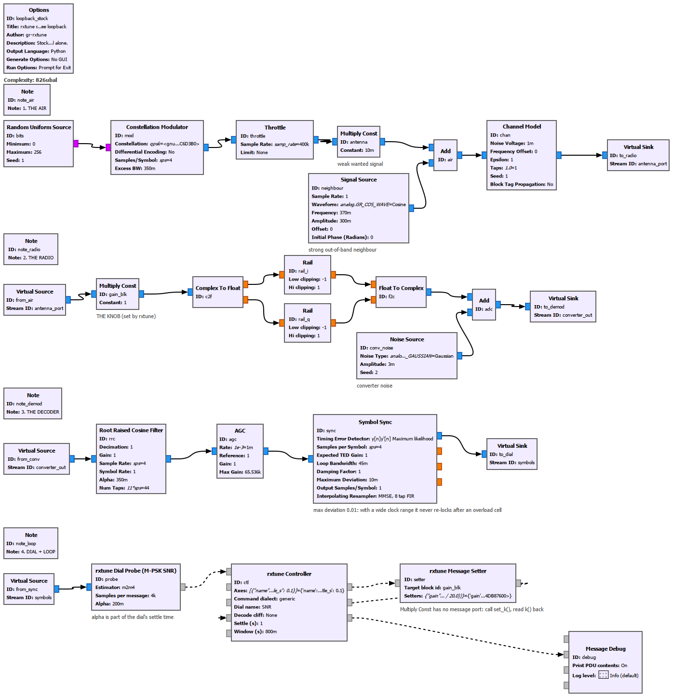

# Follow along in GNU Radio Companion

No radio needed. Ten minutes. Every picture on this page was produced from the
files in this repository (`util/grc_screenshot.py` renders GRC's own canvas;
`util/run_grc_qt.py` runs the flowgraph and saves the window).

## 0. Make GRC see the blocks

Nothing is compiled. **Installed** (`mkdir build && cd build && cmake .. && make
install`), the blocks appear in GRC like any other module.

**From the source tree**, two things are needed: GRC must find the block
definitions, and Python must find the packages.

```
export GRC_BLOCKS_PATH=/path/to/gr-rxtune/grc          # Windows: set GRC_BLOCKS_PATH=...
pip install -e /path/to/gr-rxtune                      # the pure-Python core, `rxtune`
gnuradio-companion examples/loopback_qtgui.grc
```

The GNU Radio half lives in the package `gnuradio.rxtune`, which only exists once
installed. Uninstalled, GRC will open, draw and generate the flowgraph, but to
*run* it use `python util/run_grc_qt.py build/grc/loopback_qtgui.py` (or import
`examples/_devpath.py` first): that grafts this repo's `python/` directory onto
the `gnuradio` package. For day-to-day GRC use, install.

> If GRC, `grcc` or `gr_modtool` behave as if they belonged to a different GNU
> Radio, look for a stale `GR_PREFIX` or `GRC_BLOCKS_PATH` in your environment.

Open the block tree and search `rxtune`. You should see six blocks:


## 1. Open `examples/loopback_qtgui.grc`


Read it top to bottom. Solid wires carry samples, dashed wires carry messages,
and each `Virtual Sink` hands its stream to the `Virtual Source` of the same name
on the next row.

**Row 1 - the air.** Random bits through a stock *Constellation Modulator* make
a QPSK signal, scaled down to a *weak* wanted signal (x 0.01). A *Signal Source*
adds a **strong neighbour** well outside the wanted signal's bandwidth
(amplitude 0.3, thirty times stronger). *Channel Model* adds a little noise.
This is the situation every real antenna is in.

**Row 2 - the radio.** One *Multiply Const* is **the gain knob** - the thing
rxtune will turn. After it comes a crude converter: both rails clipped at +/-1
(*Rail*), plus the converter's own noise (*Noise Source*). So:

- too little gain, and the wanted signal drowns in converter noise;
- too much, and the *neighbour* hits the rails and splatters across everything.

Somewhere between is a ridge. Power alone will not find it: the total power
keeps rising with gain right through the point where decoding collapses.

**Row 3 - the decoder.** A stock demodulator: *Root Raised Cosine*, *AGC*,
*Symbol Sync*. Note the comment on Symbol Sync - it matters (section 4).

**Row 4 - the dial and the loop.**
- **rxtune Dial Probe** wraps GNU Radio's own M-PSK SNR estimator and publishes
  the decoder's quality, in dB, as a message. That number is *the dial*.
- **rxtune Controller** receives the dial, decides the next gain to try, and
  publishes one small command per knob write. It has no GUI and no streams.
- **rxtune Message Setter** turns that command into `gain_blk.set_k(...)`,
  because *Multiply Const* (like *Channel Model*, like the osmocom source) has no
  message port of its own - then reads `k()` back and reports it, so the
  controller knows the write really happened.
- **rxtune Dashboard** and a stock *Message Debug* show what is going on.

The QT GUI *Range*, *Time Sink*, *Frequency Sink* and *Number Sink* are stock
gr-qtgui blocks; the dashboard docks beside them through its **GUI Hint** like
any other Qt widget.

`examples/loopback_stock.grc` is the same graph with every Qt block removed
(Generate Options: No GUI) - the controller does not need a screen.



## 2. Run it

Press play. In about forty seconds:


- **Frequency Sink:** the wanted signal is the shelf in the middle; the spike on
  the right is the neighbour. Watch them both rise and fall as the controller
  walks the gain, and watch the floor come up when the neighbour clips.
- **Dashboard, left:** the live dial.
- **Dashboard, right:** one cell per gain the controller has tried, coloured by
  the dial. The search is visible: five coarse cells spanning the *whole* range,
  then refinement around the two best regions, steps halving. The white box is
  the pick. You can see the curve's shape - a slope, a peak, a collapse.
- **Verdict:** `UNPROVEN - SNR ~29 dB`, with the note *overload ridge: the dial
  collapses from {'gain': 10} upward*.

`UNPROVEN` is deliberate. The dial is excellent, but nothing in this flowgraph
proves that *content* is being decoded, so rxtune will not call the setting
good. Wire a counter of decoded frames or packets into the controller's
`liveness` port and the verdict becomes `HEALTHY`; wire one that never advances
and it becomes `PLUMBING` - good RF, broken decoder. (`python/rxtune/qa_loopback.py`
does both.)

Now drag **Neighbour level** up and send the controller `{"recal": True}` on its
`ctrl` port: the ridge moves, and so does the answer. That is the whole point -
the best gain depends on what *else* is on the antenna, which no fixed setting
and no power meter knows.

## 3. Put a real radio in

Replace rows 1 and 2 with a **Soapy Source**, and tell the controller what your
device has (`rxtune discover` lists it):

| Controller parameter | Value |
|---|---|
| Command dialect | `soapy` |
| Axes | `[{"name": "gain:LNA", "lo": 0, "hi": 40, "step": 8}, {"name": "gain:VGA", "lo": 0, "hi": 62, "step": 2}]` |
| Settle / Window | what *your decoder* needs after a gain change |
| Decode cliff | your decoder's threshold, if you know it |

Connect the controller's `cmd` straight to the Soapy Source's `cmd`. Per-element
gain, antenna and frequency go by message (measured on hardware). Two things do
**not**: device *settings* by message stop a SoapySDRPlay source outright (the
controller refuses to send them), and the osmocom source has no message port at
all. For both, use the Message Setter with the block's setter methods.

Replace row 3 with your decoder and give the controller its quality number:
- a stream block that tags quality -> **rxtune Dial From Tag**
- a decoder that prints telemetry -> **rxtune Dial Adapter** (ATSC and NRSC-5 ship)
- M-PSK -> **rxtune Dial Probe** as here

Outside GNU Radio the same loop is a few lines of Python; see `docs/USAGE.md`
and `examples/hw_nrsc5.py`, which tunes a radio against an unmodified `nrsc5`.

## 4. Two traps this flowgraph is built to teach

Both produced confident, wrong answers while this example was being written.

1. **The dial's own averaging is part of its settle time.** At GNU Radio's
   default `alpha` the SNR estimator still describes the *previous* gain several
   seconds after a change. The probe here uses 0.2, and the controller's
   **Settle** is longer than the estimator's memory.
2. **A demodulator with hysteresis poisons every later measurement.** With
   Symbol Sync's default *Maximum Deviation* (1.5) the loop wanders off during an
   overload cell and never re-locks: the same gain read 30 dB, and a minute later
   9 dB. It is set to 0.01 here. If your decoder needs time to re-acquire, that
   time belongs in **Settle**.
